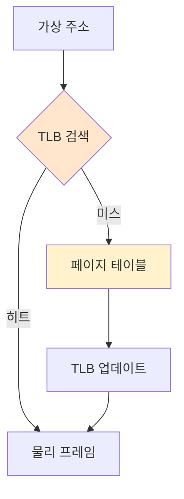

#컴퓨터구조

### TLB란

TLB(Translation Lookaside Buffer)는 최근 사용한 [[링크/컴퓨터구조/메모리계층구조/가상메모리/페이지 테이블]] 엔트리를 저장하는 하드웨어 [[캐시]]입니다. 주소 변환 속도를 크게 향상시킵니다.

### 왜 필요한가

[[페이징]] 방식에서는 메모리 접근마다 페이지 테이블을 먼저 읽어야 합니다. 즉, 1번의 메모리 접근이 2번으로 늘어납니다. TLB는 이 오버헤드를 줄입니다.

### TLB 동작

**TLB 히트**: 찾는 페이지 번호가 TLB에 있으면 바로 프레임 번호 반환
**TLB 미스**: TLB에 없으면 페이지 테이블을 읽어 TLB에 캐시

### TLB 특징

**크기**: 보통 64~1024 엔트리 (페이지 테이블보다 훨씬 작음)
**속도**: CPU 클럭 속도로 동작 (1 사이클)
**히트율**: [[지역성 원리]] 덕분에 보통 95% 이상
**완전 연관 매핑**: 어떤 엔트리든 저장 가능 (Fully Associative)

### 컨텍스트 스위칭

프로세스가 바뀌면 TLB를 비워야 합니다. 각 프로세스마다 다른 페이지 테이블을 사용하기 때문입니다. ASID(Address Space ID)를 사용하면 플러시 없이 여러 프로세스의 엔트리를 공존시킬 수 있습니다.

### 백엔드 개발과의 연관성

대량의 데이터를 순차 접근하면 TLB 히트율이 높지만, 랜덤 접근하면 TLB 미스가 증가합니다. 데이터베이스 쿼리 최적화 시 메모리 접근 패턴도 고려해야 합니다.
