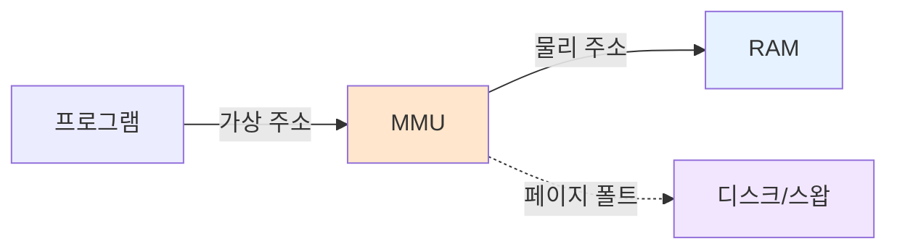

#컴퓨터구조

### 가상 메모리란

가상 메모리(Virtual Memory)는 물리 [[RAM]] 크기보다 큰 프로그램을 실행할 수 있게 해주는 메모리 관리 기법입니다. 프로그램은 가상 주소를 사용하고, 운영체제가 이를 물리 주소로 변환합니다.

### 왜 필요한가

[[물리 메모리의 한계]] — 물리 RAM만으로는 다중 프로세스의 주소 충돌, 메모리 보호, 용량 부족 문제를 해결할 수 없습니다. 가상 메모리는 [[Storage]]의 일부를 RAM처럼 사용하고, 프로세스마다 독립된 주소 공간을 제공하여 이를 해결합니다.

### 주소 변환

**가상 주소 공간**: 프로그램이 보는 메모리 주소 (0x0000부터 시작)
**물리 주소 공간**: 실제 RAM의 주소
**MMU(Memory Management Unit)**: CPU 내부에서 주소 변환을 담당

### 주요 이점

**1. 메모리 격리**: 각 프로그램이 독립된 주소 공간을 가져 다른 프로그램의 메모리에 접근 불가
**2. 메모리 확장**: 물리 RAM보다 큰 프로그램 실행 가능
**3. 효율적 사용**: 실제로 사용 중인 부분만 RAM에 적재

### 백엔드 개발과의 연관성

JVM의 `-Xmx` 옵션으로 힙 메모리를 설정할 때, 물리 RAM보다 크게 설정해도 가상 메모리 덕분에 실행됩니다. 하지만 과도하면 스왑으로 인한 성능 저하가 발생합니다.
