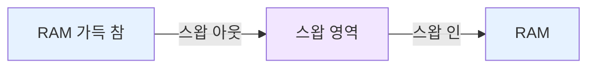

#컴퓨터구조

### 스왑이란

스왑(Swap)은 [[RAM]]이 부족할 때 [[Storage]]의 일부를 RAM처럼 사용하는 공간입니다. 사용하지 않는 페이지를 디스크로 옮겨 RAM 공간을 확보합니다.

### 스왑 영역

운영체제는 디스크에 스왑 전용 공간을 예약합니다. Linux는 스왑 파티션이나 스왑 파일을 사용하고, Windows는 `pagefile.sys`를 사용합니다.

### 스왑 아웃과 스왑 인

**스왑 아웃(Swap Out)**: RAM의 페이지를 디스크로 내보냄
**스왑 인(Swap In)**: 디스크의 페이지를 RAM으로 가져옴
[[페이지 폴트]] 처리 시 RAM이 가득 차면 스왑 아웃 후 스왑 인을 수행합니다.

### 성능 저하

스왑은 디스크 I/O를 발생시켜 매우 느립니다. RAM 접근은 나노초 단위지만 디스크는 밀리초 단위입니다. 스왑을 많이 사용하면 시스템이 매우 느려집니다.

### 스왑 사용 모니터링

Linux에서 `free -h` 명령으로 스왑 사용량을 확인할 수 있습니다. `top` 명령에서 `%MEM`과 `SWAP` 항목을 보면 프로세스별 메모리 사용을 알 수 있습니다.

### 백엔드 개발과의 연관성

Spring 애플리케이션이 메모리를 많이 사용하면 스왑이 발생할 수 있습니다. `-Xmx` 설정을 물리 RAM의 70% 이하로 유지하고, 스왑 사용률을 모니터링해야 합니다. AWS EC2에서는 스왑을 비활성화하는 것이 권장됩니다.
