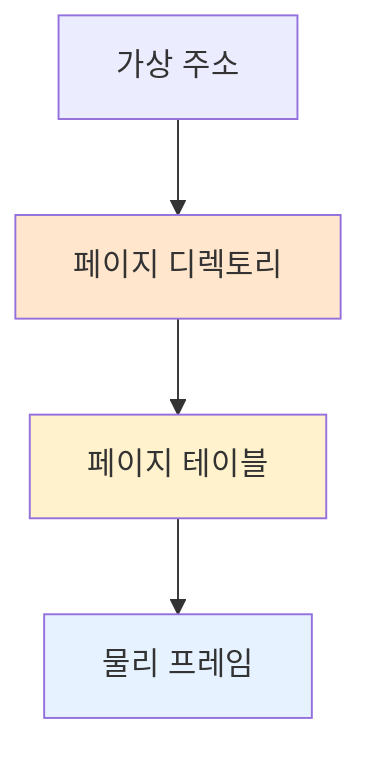

#컴퓨터구조

### 페이지 테이블이란

페이지 테이블(Page Table)은 가상 페이지 번호를 물리 프레임 번호로 변환하는 매핑 테이블입니다. 각 프로세스마다 독립적인 페이지 테이블을 가집니다.

### 페이지 테이블 구조

페이지 테이블은 배열 형태로, 인덱스가 가상 페이지 번호이고 값이 물리 프레임 번호입니다. 예를 들어 `PT[2] = 7`이면 가상 페이지 2번이 물리 프레임 7번에 매핑됩니다.

### 페이지 테이블의 문제

64비트 시스템에서 페이지 테이블이 너무 커질 수 있습니다. 가상 주소 공간이 2^48 바이트이고 페이지가 4KB라면, 페이지 테이블 엔트리가 2^36개 필요합니다.

### 다단계 페이지 테이블

페이지 테이블을 여러 단계로 나누어 공간을 절약합니다. 2단계 페이징은 페이지 디렉토리와 페이지 테이블로 구성됩니다.

### TLB 캐시

페이지 테이블 접근은 메모리 접근이므로 느립니다. [[TLB]](Translation Lookaside Buffer)는 최근 사용한 페이지 테이블 엔트리를 [[캐시]]하여 변환 속도를 높입니다.

### 백엔드 개발과의 연관성

JVM의 각 스레드는 독립적인 스택을 가지며, 이는 별도의 가상 페이지로 매핑됩니다. 스레드가 많으면 페이지 테이블 크기도 증가합니다.
