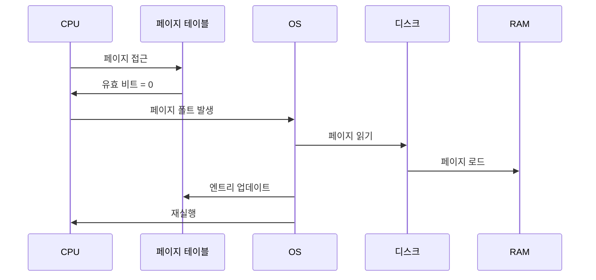

#컴퓨터구조

### 페이지 폴트란

페이지 폴트(Page Fault)는 프로그램이 접근하려는 페이지가 물리 [[RAM]]에 없을 때 발생하는 예외입니다. CPU가 실행을 중단하고 운영체제가 개입하여 처리합니다.

### 발생 과정

1. CPU가 가상 주소 접근 시도
2. [[링크/컴퓨터구조/메모리계층구조/가상메모리/페이지 테이블]]의 유효 비트가 0 (RAM에 없음)
3. 페이지 폴트 예외 발생
4. OS가 [[Storage]]에서 페이지를 RAM으로 로드
5. 페이지 테이블 업데이트
6. 명령어 재실행

### 페이지 교체

RAM이 가득 찬 상태에서 페이지 폴트가 발생하면, 기존 페이지 하나를 디스크로 내보내야 합니다. 어떤 페이지를 내보낼지 결정하는 것이 **페이지 교체 알고리즘**입니다.

### 성능 영향

페이지 폴트는 디스크 I/O를 발생시켜 매우 느립니다. RAM 접근은 100ns인 반면, 디스크 접근은 10ms로 10만 배 차이가 납니다. 페이지 폴트가 자주 발생하면 **스래싱(Thrashing)** 상태가 됩니다.

### 스래싱

프로그램이 페이지 폴트를 처리하느라 실제 작업을 거의 못하는 상태입니다. RAM이 부족하면 발생하며, 시스템이 극도로 느려집니다.

### 백엔드 개발과의 연관성

Spring 애플리케이션이 `-Xmx`를 물리 RAM보다 크게 설정하면 스왑을 사용하게 되어 페이지 폴트가 빈번히 발생합니다. 모니터링에서 swap usage가 높으면 성능 문제의 신호입니다.
