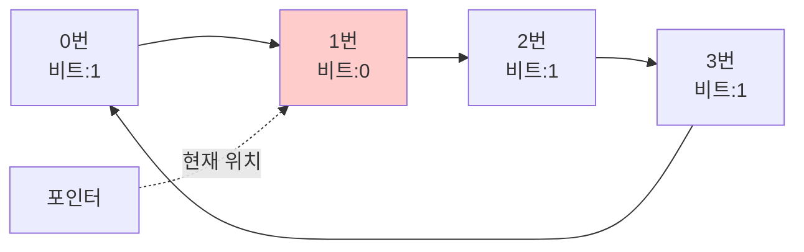

#컴퓨터구조

### Clock 알고리즘이란

Clock 알고리즘(Second Chance)은 [[LRU]]의 근사 알고리즘으로, 구현이 간단하면서도 성능이 좋습니다. 참조 비트(Reference Bit)를 사용하여 최근 사용 여부를 판단합니다.

### 동작 원리

각 페이지는 참조 비트를 가집니다. 페이지 접근 시 비트를 1로 설정합니다. 시계 바늘처럼 포인터가 순환하며 다음을 확인합니다:
- 참조 비트 = 0: 해당 페이지 교체
- 참조 비트 = 1: 0으로 변경하고 다음 페이지로 이동 (두 번째 기회)

### 왜 Clock인가

페이지들을 원형으로 배치하고 포인터가 시계처럼 회전하며 검사하기 때문입니다. "Second Chance"라고도 불립니다.

### 장점과 단점

**장점**: [[LRU]]와 비슷한 성능, 구현이 간단, 타임스탬프 불필요
**단점**: 완벽한 LRU는 아니며, 최악의 경우 모든 페이지를 검사

### 개선: Enhanced Clock

참조 비트와 수정 비트(Dirty Bit)를 함께 사용합니다. 수정되지 않은 페이지를 우선 교체하여 디스크 쓰기를 줄입니다.

### 백엔드 개발과의 연관성

Linux 커널의 페이지 교체가 Clock 알고리즘 변형을 사용합니다. Spring 애플리케이션이 리눅스에서 실행될 때 이 알고리즘의 영향을 받습니다.
