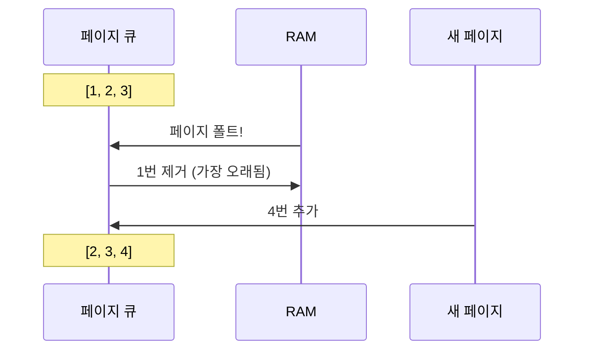

#컴퓨터구조

### FIFO란

FIFO(First-In-First-Out)는 가장 먼저 메모리에 들어온 페이지를 먼저 교체하는 알고리즘입니다. 큐(Queue) 구조로 구현됩니다.

### 동작 원리

1. 페이지가 들어온 순서를 큐로 관리
2. [[페이지 폴트]] 발생 시 큐의 맨 앞 페이지를 교체
3. 새 페이지를 큐의 맨 뒤에 추가

### 장점과 단점

**장점**: 구현이 매우 간단하고 오버헤드가 낮음
**단점**: 자주 사용되는 페이지도 오래되면 교체될 수 있음 (Belady's Anomaly 발생 가능)

### Belady's Anomaly

메모리 프레임 수를 늘렸는데 오히려 페이지 폴트가 증가하는 현상입니다. FIFO는 페이지 사용 빈도를 고려하지 않아 이 문제가 발생합니다.

### 백엔드 개발과의 연관성

메시지 큐(RabbitMQ, Kafka)도 FIFO 원리로 동작합니다. 먼저 들어온 메시지를 먼저 처리하지만, 우선순위가 없어 중요한 메시지가 늦게 처리될 수 있습니다.
