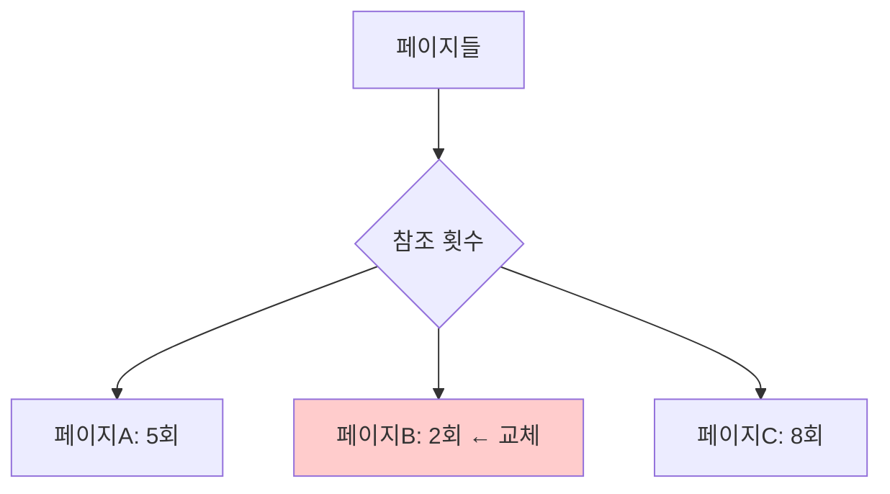

#컴퓨터구조

### LFU란

LFU(Least Frequently Used)는 참조 횟수가 가장 적은 페이지를 교체하는 알고리즘입니다. 자주 사용되는 페이지는 앞으로도 자주 사용될 것이라는 가정을 기반으로 합니다.

### 동작 원리

각 페이지마다 참조 횟수(카운터)를 기록합니다. [[페이지 폴트]] 발생 시 카운터 값이 가장 낮은 페이지를 교체합니다.

### 동점 처리

참조 횟수가 같은 페이지가 여러 개일 때는 [[FIFO]] 또는 [[LRU]] 방식을 추가로 사용합니다.

### 장점과 단점

**장점**: 자주 사용되는 페이지를 잘 보호함
**단점**: 초기에 많이 사용된 페이지가 나중에는 불필요해져도 계속 메모리에 남음, 카운터 관리 오버헤드

### LRU vs LFU

**LRU**: 최근성(Recency) 중시 - "언제" 사용했는가
**LFU**: 빈도(Frequency) 중시 - "몇 번" 사용했는가

### 백엔드 개발과의 연관성

Redis의 `maxmemory-policy=allkeys-lfu` 옵션이 LFU를 사용합니다. API 응답 캐싱 시 자주 호출되는 엔드포인트의 결과를 오래 유지합니다.
