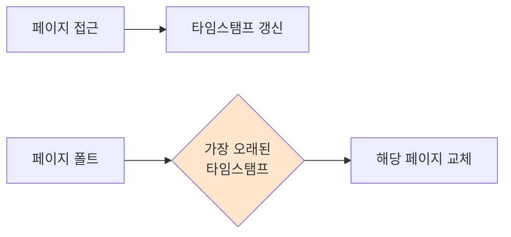

#컴퓨터구조

### LRU란

LRU(Least Recently Used)는 가장 오랫동안 사용하지 않은 페이지를 교체하는 알고리즘입니다. [[지역성 원리]]의 시간적 지역성을 활용합니다.

### 동작 원리

각 페이지마다 마지막 참조 시각을 기록합니다. [[페이지 폴트]] 발생 시 가장 오래 전에 참조된 페이지를 교체합니다.

### 구현 방법

**카운터 방식**: 각 페이지에 참조 시각 저장
**스택 방식**: 참조된 페이지를 스택 맨 위로 이동
**리스트 방식**: 이중 연결 리스트로 참조 순서 관리

### 장점과 단점

**장점**: 페이지 폴트율이 낮고, Belady's Anomaly가 발생하지 않음
**단점**: 구현 오버헤드가 크고, 모든 페이지 접근마다 타임스탬프 갱신 필요

### 근사 알고리즘

완벽한 LRU는 비용이 높아 실제로는 [[Clock]] 알고리즘 같은 근사 방법을 사용합니다.

### 백엔드 개발과의 연관성

Redis의 `maxmemory-policy=allkeys-lru` 옵션이 LRU를 사용합니다. Spring `@Cacheable`과 함께 사용하면 가장 오래 사용하지 않은 캐시 항목이 자동으로 제거됩니다.
