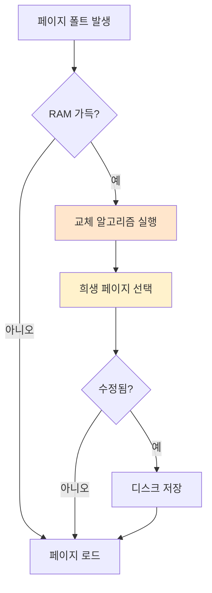

#컴퓨터구조

### 페이지 교체 알고리즘이란

[[페이지 폴트]] 발생 시 RAM이 가득 차 있으면, 기존 페이지 하나를 디스크로 내보내고 새 페이지를 가져와야 합니다. 어떤 페이지를 내보낼지 결정하는 것이 **페이지 교체 알고리즘**입니다.

### 왜 필요한가

잘못된 페이지를 내보내면 곧바로 다시 필요해져 페이지 폴트가 반복됩니다. 좋은 알고리즘은 페이지 폴트 횟수를 최소화하여 성능을 향상시킵니다.

### 주요 알고리즘

**[[FIFO]]**: 가장 먼저 들어온 페이지를 교체
**[[LRU]]**: 가장 오래 사용하지 않은 페이지를 교체
**[[LFU]]**: 가장 적게 사용된 페이지를 교체
**[[Clock]]**: LRU의 근사 알고리즘, 효율적 구현

### 성능 평가

페이지 폴트율(Page Fault Rate)로 알고리즘을 평가합니다. 같은 참조 문자열에 대해 폴트가 적을수록 좋은 알고리즘입니다.

### 백엔드 개발과의 연관성

Spring 애플리케이션에서 캐시 전략을 선택할 때도 비슷한 원리를 사용합니다. Redis의 `maxmemory-policy` 설정에서 `allkeys-lru`, `allkeys-lfu` 등을 선택할 수 있습니다.
