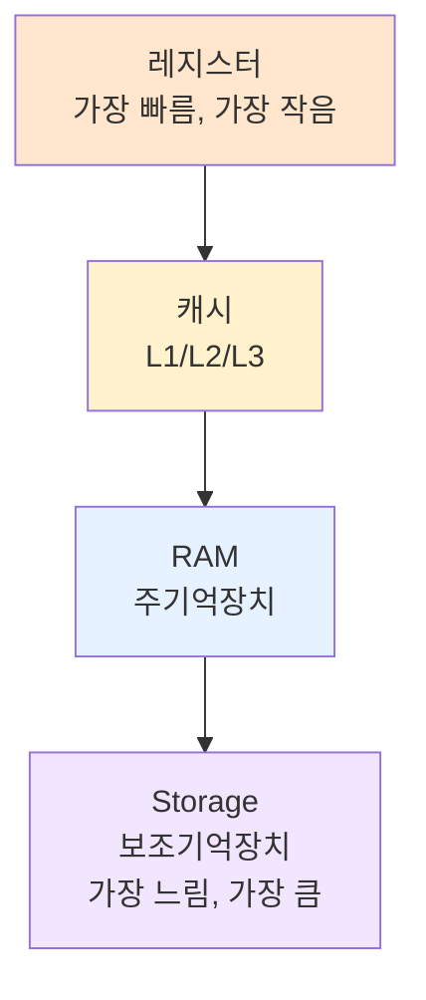

#컴퓨터구조

### 메모리 계층 구조란

메모리 계층 구조(Memory Hierarchy)는 속도와 용량의 트레이드오프를 해결하기 위해 여러 계층의 메모리를 조합한 구조입니다. 빠르지만 비싼 메모리와 느리지만 저렴한 메모리를 함께 사용합니다.

### 계층 구조 개요

CPU에 가까울수록 빠르고 비싸며 용량이 작습니다. CPU에서 멀수록 느리고 저렴하며 용량이 큽니다. **[[archive/제프/OS/레지스터]] → [[캐시]] → [[RAM]] → [[Storage]]** 순서로 배치됩니다.

### 각 계층의 특징

**레지스터**: CPU 내부, 1ns 미만, 수백 바이트
**캐시**: CPU 근처, 1-10ns, 수 MB
**RAM**: 메인보드, 50-100ns, 수십 GB
**Storage**: 별도 장치, 수 ms, 수 TB

### 지역성 원리

메모리 계층 구조가 효율적으로 작동하는 이유는 **지역성(Locality)** 때문입니다. 시간적 지역성은 최근 사용한 데이터를 다시 사용할 가능성이 높고, 공간적 지역성은 인접한 데이터를 함께 사용할 가능성이 높습니다.

### 데이터 이동

CPU가 데이터를 요청하면 레지스터 → 캐시 → RAM → Storage 순서로 찾습니다. 상위 계층에 없으면 하위 계층에서 가져와 상위 계층에 복사합니다.

### 백엔드 개발과의 연관성

애플리케이션의 캐싱 전략과 동일합니다. Redis(캐시) → MySQL(RAM) → 디스크(Storage) 구조로 데이터를 계층화하여 성능을 최적화합니다.
