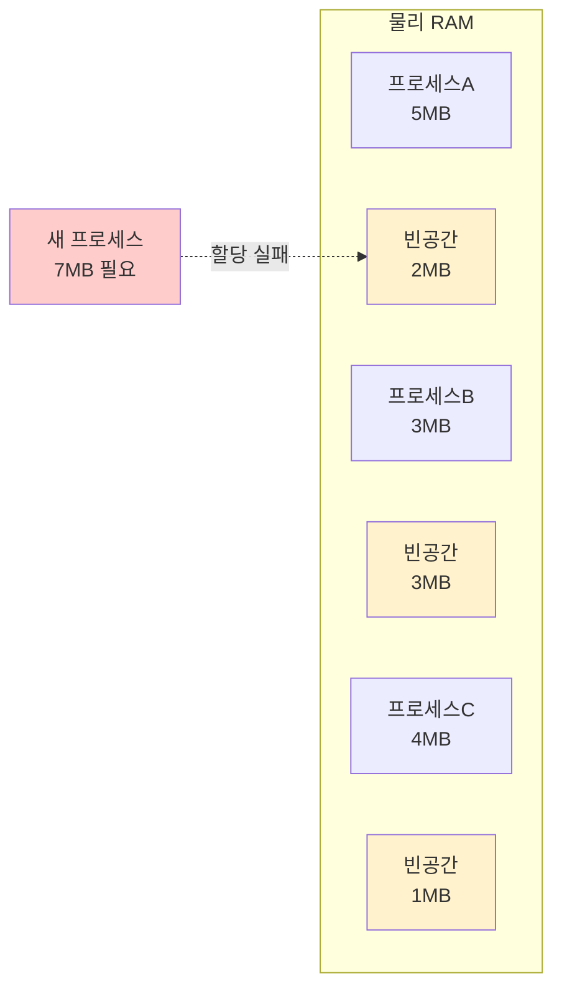

#컴퓨터구조

### 메모리 단편화란

메모리 단편화(Memory Fragmentation)는 **물리 [[RAM]]에서 발생하는 문제**로, 메모리 공간이 충분히 있음에도 불구하고 연속된 공간이 없어 할당할 수 없는 현상입니다. **외부 단편화**와 **내부 단편화** 두 가지가 있습니다.

### 외부 단편화

메모리가 **작은 조각들로 흩어져** 있어, 큰 프로세스를 할당할 연속 공간이 없는 현상입니다. **세그먼테이션(Segmentation)** 방식에서 주로 발생합니다.

총 빈 공간은 6MB이지만, 연속된 7MB 공간이 없어 할당 실패합니다.

### 내부 단편화

할당된 메모리 블록 **내부에 사용하지 않는 공간**이 생기는 현상입니다. **[[페이징]]** 방식에서 주로 발생합니다.

**예시**: 페이지 크기가 4KB인데 프로세스가 4.5KB 메모리를 요구하면, 2개 페이지(8KB)를 할당하게 되고 3.5KB가 낭비됩니다.

### 해결 방법

**외부 단편화**: [[페이징]] 사용, 메모리 압축(Compaction)
**내부 단편화**: 작은 페이지 크기 사용 (하지만 [[링크/컴퓨터구조/메모리계층구조/가상메모리/페이지 테이블]] 크기 증가)

### 페이징과의 관계

[[페이징]]은 외부 단편화를 **해결**하는 방법입니다. 고정 크기 페이지로 나누기 때문에 어떤 프레임에든 배치 가능합니다. 하지만 내부 단편화는 발생합니다 (평균 0.5 페이지 손실).

### 백엔드 개발과의 연관성

JVM의 가비지 컬렉션도 메모리 단편화를 줄이기 위해 압축을 수행합니다. Spring Boot 애플리케이션의 힙 메모리도 단편화되면 Full GC가 빈번해집니다.
