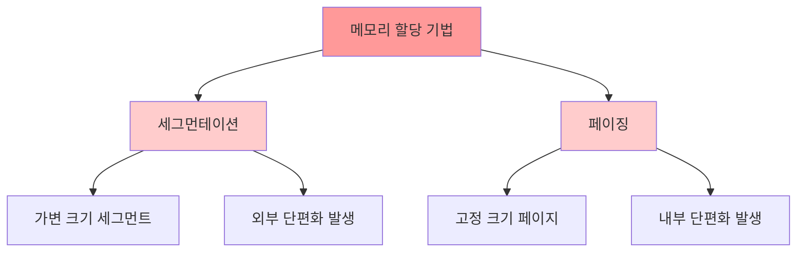

#컴퓨터구조 

### 개념
운영체제가 프로세스를 물리 메모리(RAM)에 배치하는 방법론. 프로세스를 어떤 단위로 나누어 메모리에 적재할 것인가를 결정.

### 주요 기법
**[[링크/컴퓨터구조/메모리계층구조/세그먼테이션]]**: 프로세스를 논리적 단위(코드, 데이터, 스택)로 분할하여 가변 크기 세그먼트로 할당. 외부 단편화 발생.

**[[페이징]]**: 프로세스를 고정 크기 페이지로 분할하여 물리 메모리의 프레임에 할당. 내부 단편화 발생하지만 외부 단편화 해결.

### 선택 기준
세그먼테이션은 논리적 보호와 공유에 유리하지만, 외부 단편화로 인한 메모리 낭비가 심함. 페이징은 메모리 관리가 단순하고 외부 단편화가 없어 현대 OS에서 주로 사용.

### 한계

할당 기법은 메모리를 어떤 단위로 나눌지를 결정하지만, 다중 프로세스 간 주소 충돌이나 물리 메모리 용량 초과 같은 [[물리 메모리의 한계]]는 해결하지 못함.

### 실무 적용
Linux는 페이징 기반 메모리 관리를 사용하며, JVM은 Heap 영역을 관리할 때 내부적으로 페이징 방식 활용. Spring Boot 애플리케이션도 OS의 페이징 메커니즘 위에서 동작.
