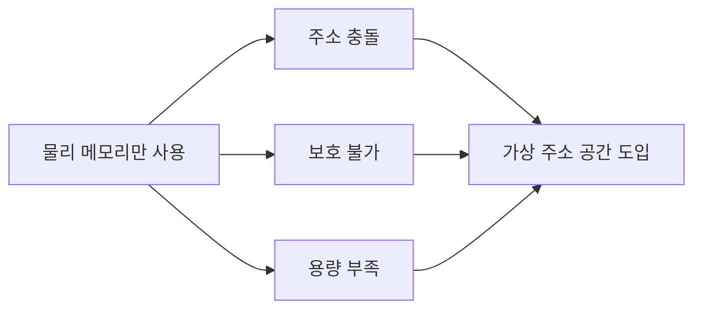

#컴퓨터구조

### 개념

물리 [[RAM]]만으로 프로세스를 관리할 때 발생하는 근본적인 문제들. [[메모리 할당 기법]]만으로는 해결할 수 없는 한계로, [[링크/컴퓨터구조/메모리계층구조/가상메모리/가상 메모리]] 도입의 직접적인 동기.

### 다중 프로세스 문제

여러 프로세스가 동시에 실행될 때, 물리 메모리를 직접 사용하면:
- **주소 충돌**: 프로세스 A와 B가 같은 물리 주소를 사용하려 함
- **메모리 보호 불가**: 다른 프로세스의 메모리 영역을 침범 가능
- **재배치 어려움**: 프로세스를 다른 주소에 로드하면 내부 주소가 깨짐

### 용량의 한계

물리 RAM은 유한. 프로세스들의 총 메모리 요구량이 RAM 크기를 초과하면 실행 불가.

### 해결 방향

가상 주소 공간을 도입하면: 프로세스마다 독립된 주소 공간 → 충돌/보호 해결, 디스크를 확장 메모리로 활용 → 용량 해결.

### 백엔드 개발과의 연관성

JVM 위 애플리케이션은 가상 주소 공간에서 동작하기 때문에, 다른 프로세스 메모리를 침범하지 않음. Docker 컨테이너의 프로세스 격리도 이 원리에 기반.
