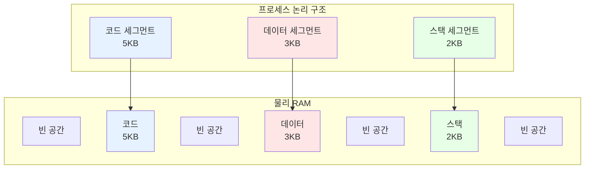

#컴퓨터구조

### 세그먼테이션이란

세그먼테이션(Segmentation)은 프로세스를 **논리적 단위(세그먼트)**로 나누어 메모리에 할당하는 기법입니다. 코드, 데이터, 스택 등 의미 있는 단위로 분할합니다.

### 세그먼트 구조

### 세그먼테이션 vs 페이징

**세그먼테이션 (가변 크기)**
- 논리적 단위로 분할 (코드, 데이터, 스택)
- 크기가 다름 → **외부 단편화 발생**
- 프로그래머가 세그먼트 인식 가능
- 보호와 공유가 쉬움

**[[페이징]] (고정 크기)**
- 물리적으로 균등 분할 (4KB 페이지)
- 크기가 같음 → 외부 단편화 없음, **내부 단편화 발생**
- 프로그래머가 인식 불가 (투명함)
- 구현이 간단

### 주소 변환 방식

**세그먼테이션**: 세그먼트 번호 + 오프셋
**[[페이징]]**: 페이지 번호 + 오프셋

세그먼트 테이블은 **base(시작 주소) + limit(크기)**를 저장하고, [[링크/컴퓨터구조/메모리계층구조/가상메모리/페이지 테이블]]은 **프레임 번호**만 저장합니다.

### 세그먼테이션의 문제점

프로세스들이 생성/종료를 반복하면 **외부 [[메모리 단편화]]가 심각해집니다**. 이를 해결하기 위해 메모리 압축(Compaction)이 필요하지만 비용이 큽니다.

### 백엔드 개발과의 연관성

리눅스는 주로 페이징을 사용하지만, x86 아키텍처는 세그먼테이션도 지원합니다. JVM의 Method Area, Heap, Stack도 논리적으로는 세그먼테이션과 유사한 구조입니다.
