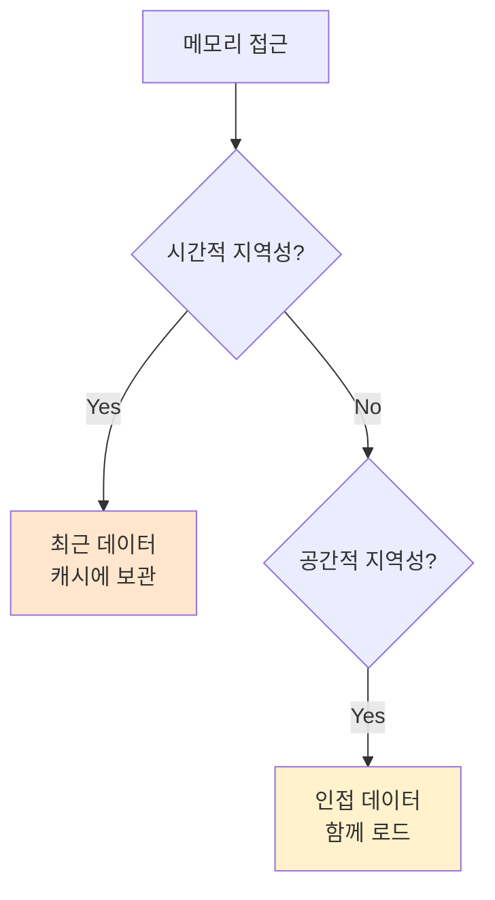

#컴퓨터구조

### 지역성 원리란

지역성 원리(Principle of Locality)는 프로그램이 특정 시점에 메모리의 일부분만 집중적으로 사용하는 경향을 말합니다. [[링크/컴퓨터구조/메모리계층구조/메모리 계층 구조]]가 효율적으로 작동하는 핵심 원리입니다.

### 시간적 지역성

시간적 지역성(Temporal Locality)은 최근 접근한 데이터를 가까운 미래에 다시 접근할 가능성이 높다는 원리입니다. 반복문의 변수, 자주 호출되는 함수가 대표적입니다.

```
for (int i = 0; i < 1000; i++) {
    sum += arr[i];  // 변수 i, sum을 반복 사용
}
```

### 공간적 지역성

공간적 지역성(Spatial Locality)은 접근한 데이터 근처의 데이터도 곧 접근할 가능성이 높다는 원리입니다. 배열을 순차적으로 접근하는 경우가 대표적입니다.

```
int arr[100];
for (int i = 0; i < 100; i++) {
    arr[i] = i;  // arr[0], arr[1], arr[2]... 순차 접근
}
```

### 캐시 활용

[[캐시]]는 시간적 지역성을 위해 최근 데이터를 보관하고, 공간적 지역성을 위해 주변 데이터를 함께 가져옵니다([[캐시]] 라인 단위).



### 지역성 위반

지역성을 위반하면 [[캐시]] 미스가 자주 발생하여 성능이 급격히 저하됩니다. 랜덤 접근, 큰 보폭의 배열 접근이 대표적입니다.

### 백엔드 개발과의 연관성

Spring의 @Cacheable은 시간적 지역성을 활용합니다. 동일한 메서드 호출 결과를 캐싱하여 DB 접근을 줄입니다. 페이지네이션도 공간적 지역성을 활용하여 연속된 데이터를 한 번에 가져옵니다.
