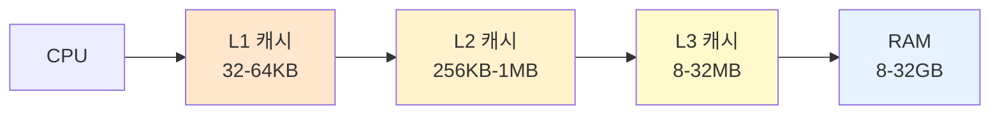

#컴퓨터구조

### 캐시란

캐시(Cache)는 CPU와 [[RAM]] 사이에 위치한 초고속 메모리로, 자주 사용하는 데이터를 임시 저장하여 메모리 접근 속도를 높입니다. [[archive/제프/OS/레지스터]]보다는 느리지만 RAM보다 훨씬 빠릅니다.

### 캐시 계층

**L1 캐시**: CPU 코어 내부, 가장 빠름(1-2ns), 용량 작음(32-64KB)
**L2 캐시**: CPU 코어 근처, 빠름(3-10ns), 중간 용량(256KB-1MB)
**L3 캐시**: 여러 코어 공유, 상대적으로 느림(10-20ns), 큰 용량(8-32MB)

### 캐시 히트와 미스

**캐시 히트**: 필요한 데이터가 캐시에 있는 경우, RAM 접근 없이 빠르게 가져옴
**캐시 미스**: 캐시에 없어서 RAM에서 가져와야 하는 경우, 성능 저하 발생

### 캐시 라인과 블록

캐시는 데이터를 **캐시 라인** 단위로 관리합니다(보통 64바이트). 하나의 데이터를 가져올 때 주변 데이터도 함께 가져와 공간적 지역성을 활용합니다.

### 교체 정책

캐시가 가득 차면 오래된 데이터를 제거해야 합니다. LRU(Least Recently Used)가 가장 흔한 방식으로, 가장 오래 사용하지 않은 데이터를 제거합니다.

### 백엔드 개발과의 연관성

Redis나 Memcached가 애플리케이션 레벨의 캐시입니다. 데이터베이스 쿼리 결과를 캐시에 저장하여, 동일한 요청 시 DB 접근 없이 빠르게 응답합니다.
