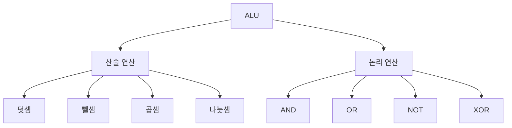

#컴퓨터구조

### ALU의 역할

ALU(Arithmetic Logic Unit, 산술논리장치)는 CPU의 계산기로, 모든 산술 연산과 논리 연산을 수행합니다.

### 연산 종류

### 동작 과정

제어장치로부터 연산 명령을 받으면, 레지스터에서 데이터를 가져와 연산을 수행하고, 결과를 다시 레지스터에 저장합니다.

### 백엔드 개발과의 연관성

Spring에서 숫자 계산, 비교 연산, 비트 연산 등 모든 계산이 최종적으로 ALU에서 실행됩니다.