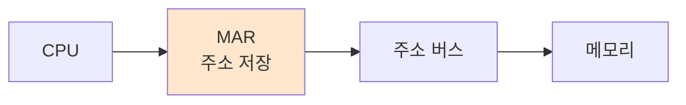

#컴퓨터구조

### MAR이란

MAR(Memory Address Register)은 접근하려는 메모리의 주소를 저장하는 레지스터입니다. CPU가 메모리에서 데이터를 읽거나 쓸 때 사용합니다.

### 동작 원리

CPU가 메모리 주소를 MAR에 저장하면, 이 주소가 [[주소 버스]]를 통해 메모리로 전달됩니다. 메모리는 MAR의 주소를 보고 어느 위치의 데이터를 가져올지 알 수 있습니다.

### MAR과 MBR의 협력

MAR은 "어디에" 접근할지 지정하고, [[MBR]]은 "무엇을" 읽거나 쓸지 담당합니다. 메모리 읽기 시 MAR로 위치를 지정하면 그 위치의 데이터가 MBR로 전달됩니다.

### 백엔드 개발과의 연관성

데이터베이스에서 인덱스로 레코드 위치를 찾는 것과 비슷합니다. MAR은 인덱스 키처럼 데이터의 위치를 가리킵니다.
