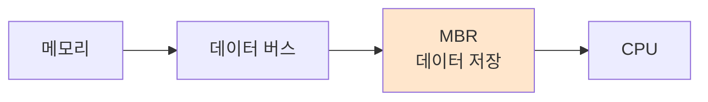

#컴퓨터구조

### MBR이란

MBR(Memory Buffer Register)은 메모리와 CPU 사이에서 데이터를 임시 저장하는 레지스터입니다. 메모리에서 읽은 데이터나 메모리에 쓸 데이터를 보관합니다.

### 동작 원리

메모리 읽기 시 [[데이터 버스]]를 통해 전달된 데이터를 MBR이 먼저 받습니다. 메모리 쓰기 시에는 CPU가 MBR에 데이터를 넣으면 데이터 버스로 전송됩니다.

### MAR과의 협력

[[MAR]]이 메모리 주소를 지정하면, MBR이 그 주소의 데이터를 받아옵니다. 예를 들어 MAR에 0x1000을 넣고 읽기 명령을 내리면, 0x1000번지의 데이터가 MBR로 들어옵니다.

### 백엔드 개발과의 연관성

네트워크 버퍼와 비슷합니다. HTTP 응답 데이터를 받을 때 버퍼에 임시 저장했다가 애플리케이션으로 전달하는 것처럼, MBR도 메모리 데이터를 임시 보관합니다.
