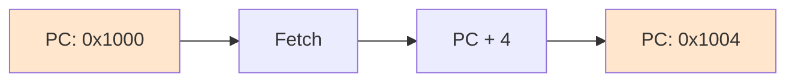

#컴퓨터구조

### PC란

PC(Program Counter)는 다음에 실행할 명령어가 저장된 메모리 주소를 가리키는 레지스터입니다. CPU가 프로그램의 어디를 실행하고 있는지 추적합니다.

### 동작 원리

[[Fetch]] 단계에서 PC가 가리키는 주소의 명령어를 메모리에서 가져옵니다. 명령어를 가져온 후 PC는 자동으로 다음 명령어 주소로 증가합니다. 보통 4바이트씩 증가합니다.

### 분기 명령어와 PC

if문이나 반복문 같은 분기 명령어를 만나면 PC 값이 점프합니다. 예를 들어 goto문을 만나면 PC가 목적지 주소로 바뀝니다.

### 백엔드 개발과의 연관성

Java 바이트코드 실행 시 JVM의 프로그램 카운터도 비슷하게 동작합니다. 각 스레드마다 독립적인 PC를 가지고 있어 멀티스레딩이 가능합니다.
