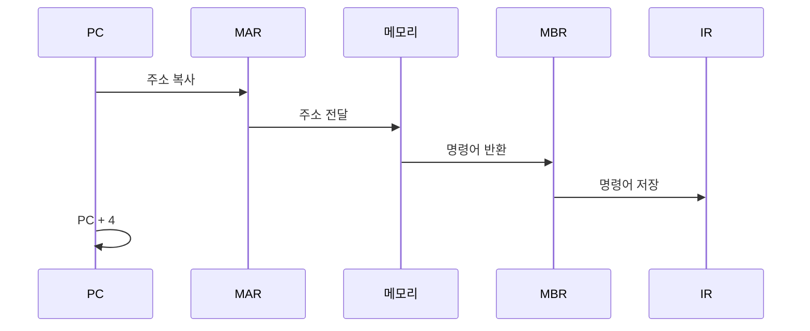

#컴퓨터구조

### 명령어 실행과 레지스터

[[명령어 실행 사이클]]의 각 단계(Fetch-Decode-Execute)에서 서로 다른 레지스터들이 협력하여 명령어를 실행합니다. 각 단계마다 특정 레지스터가 핵심 역할을 담당합니다.

### Fetch 단계의 레지스터

**[[PC]] 사용**: [[PC]]가 가리키는 메모리 주소의 명령어를 가져옵니다. [[MAR]]에 PC 값을 복사하여 메모리 주소를 지정합니다.

**[[MAR]]과 [[MBR]] 협력**: MAR이 [[주소 버스]]로 주소를 보내면, 메모리에서 명령어를 읽어 MBR로 전달합니다. MBR의 명령어는 [[IR]]로 이동합니다.

**PC 증가**: 명령어를 가져온 후 PC는 다음 명령어 주소로 자동 증가합니다(보통 +4).



### Decode 단계의 레지스터

[[IR]]에 저장된 명령어를 [[제어장치]]가 해석합니다. IR의 Opcode 부분을 보고 어떤 연산인지 판단하고, Operand 부분에서 어떤 [[링크/컴퓨터구조/컴퓨터부품/CPU내부/레지스터종류/범용 레지스터]]를 사용할지 결정합니다.

예를 들어 "ADD R1, R2, R3" 명령어라면, R1과 R2의 값을 더해서 R3에 저장하라는 의미입니다.

### Execute 단계의 레지스터

**산술/논리 연산**: [[링크/컴퓨터구조/컴퓨터부품/CPU내부/레지스터종류/범용 레지스터]]에서 피연산자를 가져와 [[ALU]]에서 연산합니다. 결과를 다시 범용 레지스터에 저장합니다.

**메모리 접근**: LOAD/STORE 명령어는 MAR과 MBR을 다시 사용합니다. MAR로 메모리 주소 지정, MBR로 데이터 전송합니다.

**분기 명령**: JUMP 명령어는 PC 값을 변경하여 프로그램 흐름을 바꿉니다.

### 전체 사이클 예시

```
명령어: LOAD R1, 0x1000  // 0x1000 주소의 값을 R1에 로드

Fetch:
- PC(0x2000) → MAR → 메모리 → MBR → IR
- PC = 0x2004

Decode:
- IR의 Opcode: LOAD
- Operand: R1, 0x1000

Execute:
- 0x1000 → MAR
- 메모리(0x1000) → MBR
- MBR → R1(범용 레지스터)
```

### 백엔드 개발과의 연관성

JVM의 스택 프레임과 비슷합니다. 메서드 호출 시 로컬 변수 테이블(범용 레지스터), 오퍼랜드 스택(MBR/MAR), 프로그램 카운터(PC)를 사용하여 바이트코드를 실행합니다.
