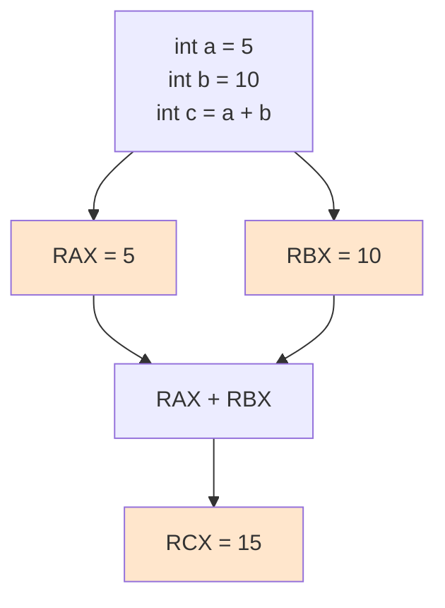

#컴퓨터구조

### 범용 레지스터란

범용 레지스터(General Purpose Register)는 프로그램이 자유롭게 사용할 수 있는 레지스터입니다. 변수 값, 연산 중간 결과, 함수 매개변수 등을 임시 저장합니다.

### 주요 특징

특수 목적이 정해지지 않아 프로그래머가 원하는 용도로 사용할 수 있습니다. x86-64 아키텍처에는 RAX, RBX, RCX, RDX 등 16개의 범용 레지스터가 있습니다.

### 사용 예시

지역 변수를 범용 레지스터에 할당하면 메모리 접근 없이 초고속 처리가 가능합니다. 반복문의 카운터 변수나 자주 사용하는 값을 저장합니다.

### 레지스터 할당

컴파일러가 자주 사용되는 변수를 범용 레지스터에 우선 할당합니다. 레지스터 개수보다 변수가 많으면 메모리를 사용합니다(레지스터 스필링).

### 백엔드 개발과의 연관성

JIT 컴파일러가 핫스팟 코드를 최적화할 때 지역 변수를 레지스터에 할당하여 성능을 향상시킵니다. Spring에서 자주 호출되는 빈의 값을 캐싱하는 것과 유사합니다.
