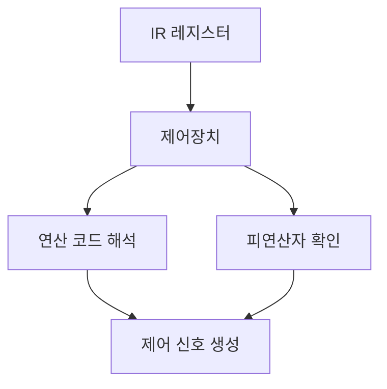

#컴퓨터구조

### Decode 단계란

Decode(해석)는 가져온 명령어가 무엇을 의미하는지 해석하는 단계입니다.

### 동작 과정

### 세부 동작

**1단계**: IR에 저장된 명령어를 제어장치가 읽습니다.

**2단계**: 명령어를 연산 코드(OpCode)와 피연산자(Operand)로 분리합니다.

**3단계**: 연산 코드를 분석하여 어떤 작업을 할지 결정합니다. (덧셈, 뺄셈, 저장 등)

**4단계**: 피연산자를 확인하여 어떤 데이터를 사용할지, 어떤 [[archive/제프/OS/레지스터]]를 사용할지 파악합니다.

**5단계**: [[ALU]]나 메모리에 보낼 제어 신호를 준비합니다.

### 백엔드 개발과의 연관성

Java 바이트코드의 각 명령어(예: iadd, iload)를 JVM이 해석하는 과정과 유사합니다.