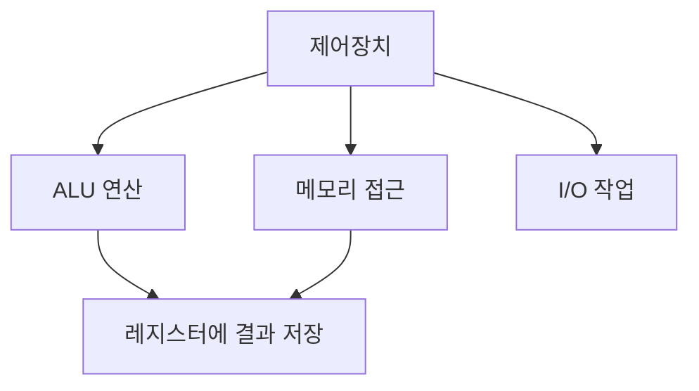

#컴퓨터구조

### Execute 단계란

Execute(실행)는 해석된 명령어를 실제로 수행하는 단계입니다.

### 동작 과정

### 세부 동작

**산술/논리 연산**: [[제어장치]]가 [[ALU]]에 제어 신호를 보내고, ALU가 [[archive/제프/OS/레지스터]]의 데이터로 연산을 수행합니다. 결과는 다시 레지스터에 저장됩니다.

**메모리 접근**: 데이터를 메모리에 저장(Store)하거나, 메모리에서 읽어옵니다(Load). [[System Bus]]를 통해 데이터가 전달됩니다.

**분기/점프**: PC(Program Counter)의 값을 변경하여 다른 주소의 명령어로 이동합니다. (if문, 반복문 등)

**I/O 작업**: 입출력장치와 데이터를 주고받습니다.

### 백엔드 개발과의 연관성

Spring에서 실제 비즈니스 로직이 실행되는 단계입니다. 계산, 데이터베이스 접근, API 호출 등이 여기서 이루어집니다.