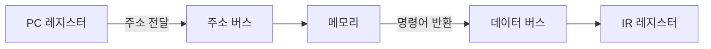

#컴퓨터구조

### Fetch 단계란

Fetch(인출)는 메모리에서 다음에 실행할 명령어를 CPU로 가져오는 단계입니다.

### 동작 과정

### 세부 동작

**1단계**: PC(Program Counter)가 다음 실행할 명령어의 메모리 주소를 가지고 있습니다.

**2단계**: 제어장치가 PC의 주소를 [[주소 버스]]를 통해 메모리에 전달합니다.

**3단계**: 메모리가 해당 주소의 명령어를 [[데이터 버스]]를 통해 CPU로 보냅니다.

**4단계**: 명령어가 IR(Instruction Register)에 저장되고, PC는 다음 명령어 주소로 증가합니다.

### 백엔드 개발과의 연관성

Spring 애플리케이션의 각 바이트코드 명령어를 메모리에서 읽어오는 과정과 동일합니다.