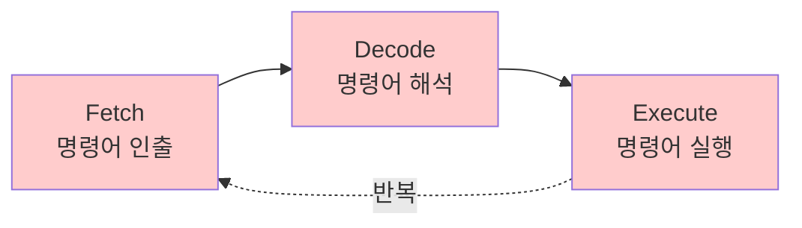

#컴퓨터구조

### 명령어 실행 사이클이란

명령어 실행 사이클은 CPU가 하나의 명령어를 처리하는 전체 과정입니다. [[Fetch]], [[Decode]], [[Execute]]의 3단계로 구성되며, 이 과정을 반복하여 프로그램을 실행합니다.

### 실행 사이클 흐름

### 단계별 설명

**Fetch**: 메모리에서 다음 실행할 명령어를 CPU로 가져옵니다. PC(Program Counter)가 가리키는 주소의 명령어를 IR(Instruction Register)로 읽어옵니다.

**Decode**: 가져온 명령어가 무엇을 의미하는지 해석합니다. [[제어장치]]가 명령어를 분석하여 어떤 연산을 할지, 어떤 데이터를 사용할지 파악합니다.

**Execute**: 해석된 명령어를 실제로 실행합니다. [[ALU]]가 연산을 수행하거나, 메모리 접근, [[archive/제프/OS/레지스터]] 값 변경 등을 수행합니다.

### 사이클 반복

하나의 명령어 실행이 끝나면 PC가 다음 명령어 주소로 증가하고, 다시 Fetch 단계로 돌아가 계속 반복됩니다. 프로그램이 종료될 때까지 이 사이클이 무한 반복됩니다.

### 백엔드 개발과의 연관성

Java 코드가 컴파일되면 바이트코드가 되고, JVM이 이 바이트코드를 한 줄씩 Fetch-Decode-Execute 과정으로 실행합니다.
