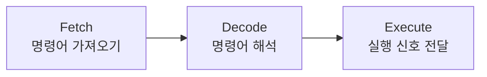

#컴퓨터구조

### 제어장치의 역할

제어장치(Control Unit)는 CPU의 지휘자로, 명령어를 해석하고 다른 부품들에게 제어 신호를 보냅니다.

### 주요 기능

### 명령어 사이클

**Fetch**: 메모리에서 다음 실행할 명령어를 가져옵니다.

**Decode**: 명령어가 무엇을 의미하는지 해석합니다. (더하기, 빼기, 저장 등)

**Execute**: ALU나 메모리에 실행 신호를 보냅니다.

### 백엔드 개발과의 연관성

Java 바이트코드가 JVM에서 실행될 때도 이와 유사한 과정을 거칩니다. 각 바이트코드 명령어를 읽고, 해석하고, 실행합니다.