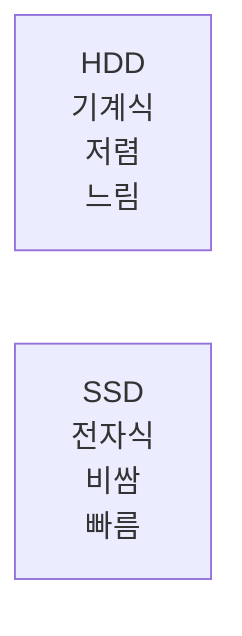

#컴퓨터구조

### Storage의 역할

Storage는 데이터를 영구적으로 보관하는 보조기억장치입니다. HDD(하드디스크)와 SSD(솔리드스테이트드라이브)가 대표적입니다.

### HDD vs SSD

### 특징

**비휘발성**: 전원이 꺼져도 데이터가 유지됩니다.

**대용량**: RAM보다 훨씬 큰 용량을 저렴하게 제공합니다.

**속도**: RAM보다 느리지만, 운영체제와 프로그램, 데이터베이스 파일을 저장합니다.

### 백엔드 개발과의 연관성

데이터베이스 파일, 로그 파일, 업로드된 파일들이 Storage에 저장됩니다. SSD를 사용하면 DB 쿼리 성능이 크게 향상됩니다.