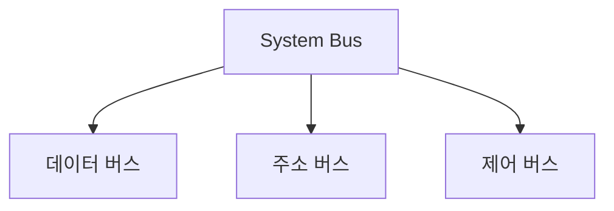

#컴퓨터구조

### System Bus의 역할

시스템 버스는 CPU, 메모리, I/O 장치 등 컴퓨터 부품들을 연결하는 통신 통로입니다.

### 버스의 종류

### 각 버스의 기능

**데이터 버스**: 실제 데이터를 전송합니다. 양방향 통신이 가능합니다.

**주소 버스**: 데이터를 읽거나 쓸 메모리 주소를 전송합니다. CPU에서 메모리/I/O로 단방향입니다.

**제어 버스**: 읽기/쓰기 신호, 인터럽트 신호 등 제어 신호를 전송합니다.

### 동작 원리

CPU가 메모리에서 데이터를 읽을 때, 주소 버스로 주소를 보내고, 제어 버스로 읽기 신호를 보내면, 메모리가 데이터 버스를 통해 데이터를 전송합니다.