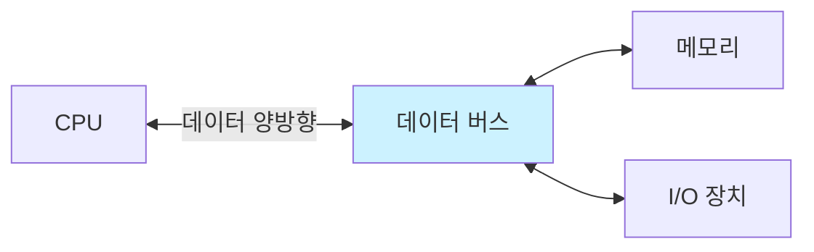

#컴퓨터구조

### 데이터 버스 (Data Bus)

데이터 버스는 CPU, 메모리, I/O 장치 간에 실제 데이터를 주고받는 버스입니다. 양방향 버스로, 읽기와 쓰기 모두 가능합니다.

### 동작 원리

CPU가 메모리에서 데이터를 읽을 때는 메모리 → CPU 방향으로, 데이터를 쓸 때는 CPU → 메모리 방향으로 데이터가 이동합니다. [[주소 버스]]가 위치를 지정하면 데이터 버스가 실제 데이터를 전송합니다.

### 버스 폭 (Bus Width)

데이터 버스의 비트 수를 버스 폭이라 하며, 한 번에 전송할 수 있는 데이터의 양을 결정합니다. 32비트 데이터 버스는 한 번에 4바이트를 전송할 수 있습니다.

### 버스 폭과 성능

버스 폭이 넓을수록 한 번에 더 많은 데이터를 전송할 수 있어 처리 속도가 빠릅니다. 64비트 시스템이 32비트보다 빠른 이유 중 하나입니다.

### 백엔드 개발과의 연관성

데이터베이스에서 데이터를 읽어올 때도 비슷합니다. 인덱스로 위치를 찾고([[주소 버스]]), 실제 데이터를 가져오는(데이터 버스) 2단계 과정입니다.
