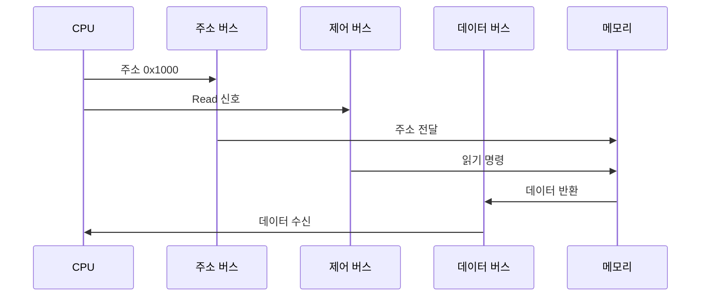

#컴퓨터구조

### 메모리 읽기 과정

CPU가 메모리에서 데이터를 읽을 때 3가지 버스가 동시에 협력합니다. [[주소 버스]]로 위치를 지정하고, [[제어 버스]]로 읽기 명령을 전달하며, [[데이터 버스]]로 데이터를 받습니다.

### 읽기 단계별 동작

**1단계 - 주소 지정**: CPU가 읽고 싶은 메모리 주소를 [[주소 버스]]에 실어 보냅니다. 예를 들어 0x1000번지의 데이터가 필요하면 주소 버스에 0x1000을 전송합니다.

**2단계 - 제어 신호**: [[제어 버스]]를 통해 Read 신호를 전송합니다. 이 신호는 메모리에게 "지금 읽기 작업이다"라고 알려줍니다.

**3단계 - 데이터 전송**: 메모리가 0x1000번지에 저장된 데이터를 [[데이터 버스]]에 실어 CPU로 보냅니다. CPU는 데이터 버스에서 데이터를 읽어 [[archive/제프/OS/레지스터]]에 저장합니다.

### 메모리 쓰기 과정

메모리에 데이터를 쓸 때도 3가지 버스가 협력하지만, 데이터 흐름 방향이 반대입니다.

**1단계 - 주소 지정**: [[주소 버스]]로 쓸 위치 지정 (예: 0x2000)

**2단계 - 제어 신호**: [[제어 버스]]로 Write 신호 전송

**3단계 - 데이터 전송**: CPU가 [[데이터 버스]]에 저장할 데이터를 실어 보내면, 메모리가 0x2000번지에 데이터를 저장합니다.

### 동시성의 중요성

3가지 버스는 **순차적이 아니라 동시에** 작동합니다. 주소 버스와 제어 버스가 동시에 신호를 보내야 메모리가 올바르게 동작합니다. 클럭 신호로 타이밍을 맞춥니다.

### 백엔드 개발과의 연관성

HTTP 요청과 비슷합니다. URL로 리소스 위치 지정([[주소 버스]]), HTTP 메서드로 동작 지시([[제어 버스]]), Request/Response Body로 데이터 전송([[데이터 버스]])합니다.
