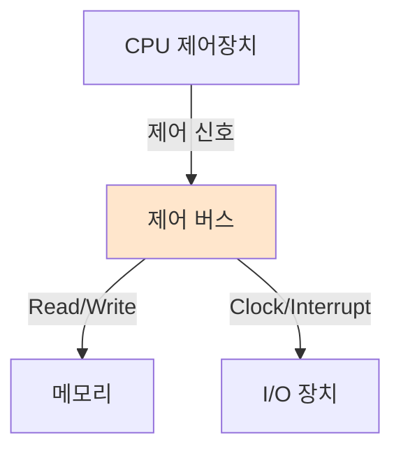

#컴퓨터구조

### 제어 버스 (Control Bus)

제어 버스는 CPU가 메모리나 I/O 장치를 제어하기 위한 신호를 전달하는 버스입니다. 읽기/쓰기 명령, 타이밍 신호, 인터럽트 신호 등을 전송합니다.

### 주요 제어 신호

**Read/Write 신호**: 메모리 읽기인지 쓰기인지 구분합니다. **Clock 신호**: 동작 타이밍을 동기화합니다. **Interrupt 신호**: I/O 장치가 CPU에 작업 완료를 알립니다. **Reset 신호**: 시스템 초기화를 수행합니다.

### 동작 원리

[[주소 버스]]로 위치를 지정하고, 제어 버스로 읽기/쓰기를 명령한 후, [[데이터 버스]]로 실제 데이터를 전송합니다. 제어 버스가 전체 동작을 조율합니다.

### 버스 간 협력

모든 버스는 협력하여 동작합니다. 예를 들어 메모리 읽기 시: 1) 주소 버스로 주소 지정 → 2) 제어 버스로 Read 신호 전송 → 3) 데이터 버스로 데이터 수신

### 백엔드 개발과의 연관성

HTTP 메서드(GET, POST, PUT, DELETE)가 제어 신호와 유사합니다. URL로 리소스를 지정하고([[주소 버스]]), HTTP 메서드로 동작을 명령하며(제어 버스), Body로 데이터를 전송합니다([[데이터 버스]]).
