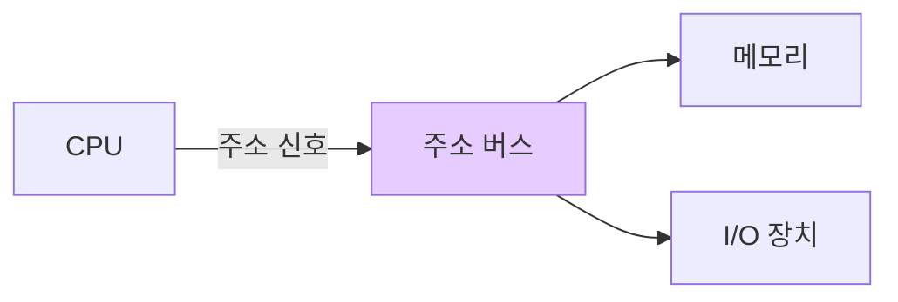

#컴퓨터구조

### 주소 버스 (Address Bus)

주소 버스는 CPU가 메모리나 I/O 장치의 특정 위치를 지정하기 위해 주소를 전달하는 버스입니다. 단방향 버스로, CPU에서 메모리/I/O로만 신호가 전달됩니다.

### 동작 원리

CPU가 메모리 주소를 주소 버스에 실어 보내면, 해당 주소의 메모리 셀이나 I/O 장치가 선택됩니다. 주소 버스의 비트 수가 주소 지정 가능한 메모리 공간을 결정합니다.

### 주소 지정 범위

주소 버스가 n비트라면 2^n개의 서로 다른 주소를 지정할 수 있습니다. 예를 들어 32비트 주소 버스는 2^32 = 4GB의 메모리 공간을 지정할 수 있습니다.

### 백엔드 개발과의 연관성

JVM의 힙 메모리 주소 지정도 비슷한 원리입니다. 객체 참조(Reference)가 실제로는 메모리 주소를 가리키며, 이를 통해 특정 객체에 접근합니다.
