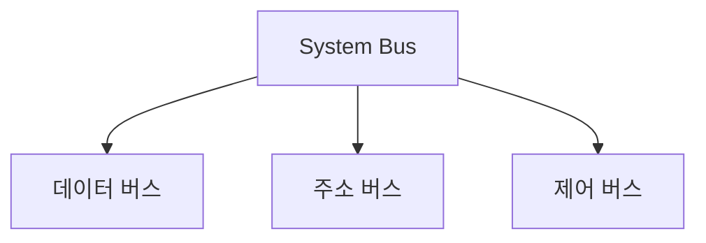

---
tags:
  - 개념
  - 컴퓨터구조
  - 컴퓨터부품
created: 2026-04-17
sources:
  - "raw/notes/컴퓨터구조/컴퓨터부품/System Bus.md"
related:
  - "[[CPU]]"
  - "[[RAM]]"
  - "[[IO Device]]"
  - "[[Storage]]"
  - "[[주소 버스]]"
  - "[[데이터 버스]]"
  - "[[제어 버스]]"
  - "[[메모리 읽기쓰기]]"
  - "[[DMA]]"
---

## 왜 이 이름인가

System Bus = 시스템 버스. "Bus"는 라틴어 omnibus(모두를 위한)에서 유래. 여러 부품이 공유하는 하나의 통신 통로라는 뜻. 시스템 전체를 연결하는 버스이기 때문에 "System" Bus.

## 기존 문제

CPU, RAM, Storage, I/O 장치가 각각 존재하지만 서로 데이터를 주고받을 방법이 없으면 쓸모가 없다. 부품마다 **1:1 전용선**을 깔면 부품 N개일 때 선이 **N(N-1)/2개** — 부품이 늘어날수록 연결이 기하급수적으로 복잡해진다. "모든 부품이 공유하는 하나의 통신 통로를 만들면?" → 공유 통로 하나면 연결은 **N개**로 끝.

## 어떻게 해결하는가

System Bus가 CPU, RAM, I/O 장치를 하나의 통로로 연결한다.

| 버스 | 나르는 것 | 방향 |
|------|---------|------|
| **[[주소 버스]]** | "어디로?" — 읽거나 쓸 메모리 주소 | CPU → 메모리/IO **단방향** |
| **[[데이터 버스]]** | "무엇을?" — 실제 데이터 | **양방향** (읽기: RAM→CPU, 쓰기: CPU→RAM) |
| **[[제어 버스]]** | "어떻게?" — 읽기/쓰기·인터럽트 등 제어 신호 | 대체로 CPU→, 단 **인터럽트는 IO→CPU** |

**왜 3개로 분리했나** — 정보의 성격이 본질적으로 다름. 한 버스로 묶으면 "이 비트가 주소냐 데이터냐 신호냐" 매번 해석 필요. 물리적으로 분리하면 해석 오버헤드가 사라지고, 폭도 용도별로 최적화 가능(주소/데이터는 32·64비트, 제어는 1비트 신호 묶음).

### 동작 예시: CPU가 RAM에서 데이터 읽기

1. [[주소 버스]]로 읽을 메모리 주소를 보냄
2. [[제어 버스]]로 "읽기" 신호를 보냄
3. RAM이 [[데이터 버스]]를 통해 해당 데이터를 CPU에 전달

→ 자세한 과정은 [[메모리 읽기쓰기]] 참고

## 백엔드 개발에서의 활용

### 버스 병목 vs I/O 바운드 구분

"서버가 느린데 CPU는 놀고 있다" — 전형적인 I/O 바운드 상황. 이때 병목이 **버스**인지 **IO 장치**인지 구분이 중요.

| 구분 | 실체 | 일반 서버에서 |
|------|-----|---------------|
| **버스 자체 병목** | 버스 대역폭 포화 | 드묾. GPU 학습·NVMe 극한 처리량·고성능 NIC 같은 특수 영역 |
| **IO 장치 병목** | Storage·네트워크 **자체가** 느림 | **대부분의 실무 병목** — 버스는 이미 충분히 빠름 |

속도 계층(→ [[RAM]])에서 RAM(100ns) vs SSD(100μs, 1000배) vs 네트워크(ms). **버스는 빠른데 통로 끝의 IO 장치가 느려서** CPU가 기다리는 것.

### 다층 버스 구조

현대 컴퓨터의 "System Bus"는 개념적 이름이고, 실제론 용도별로 쪼개져 있음:

- **메모리 버스**: CPU ↔ RAM (가장 빠름)
- **PCIe**: CPU ↔ GPU·NVMe SSD·NIC
- **SATA**: 메인보드 ↔ HDD/SSD

부품 특성과 속도에 맞춰 버스가 분화됨.

### DMA — CPU를 복사 노동에서 빼내기

IO 장치가 CPU를 거치지 않고 버스로 RAM과 직접 소통하는 방식. CPU가 "한 바이트씩 복사"하던 시대의 낭비를 제거. 자세한 내용·zero-copy·백엔드 영향 → [[DMA]]

### 비동기/논블로킹 대응

IO 바운드가 실질 병목이라면, 해결은 하드웨어가 아닌 **소프트웨어 모델**. "IO 기다림 동안 스레드를 놀리지 말자" → WebFlux·Netty 같은 비동기/논블로킹 (→ [[JVM 메모리 구조]]).

- 동기·블로킹: 스레드가 IO를 기다리며 Stack 점유. 스레드 1000개 = Stack 1GB
- 비동기·논블로킹: 소수 스레드가 이벤트 루프로 수천 연결 처리

### 메모리 맵드 I/O (참고)

I/O 장치를 메모리 주소처럼 접근하는 방식. 주소 버스로 메모리와 I/O 장치를 구분 없이 다루는 구조 — 백엔드 애플리케이션 레벨에선 직접 다루지 않지만, OS·드라이버 계층의 전제.
