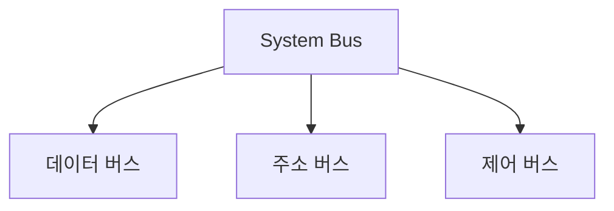

---
tags:
  - 개념
  - 컴퓨터구조
  - 컴퓨터부품
created: 2026-04-17
sources:
  - "raw/notes/컴퓨터구조/컴퓨터부품/System Bus.md"
related:
  - "[[CPU]]"
  - "[[RAM]]"
  - "[[IO Device]]"
  - "[[Storage]]"
  - "[[주소 버스]]"
  - "[[데이터 버스]]"
  - "[[제어 버스]]"
  - "[[메모리 읽기쓰기]]"
---

## 왜 이 이름인가

System Bus = 시스템 버스. "Bus"는 라틴어 omnibus(모두를 위한)에서 유래. 여러 부품이 공유하는 하나의 통신 통로라는 뜻. 시스템 전체를 연결하는 버스이기 때문에 "System" Bus.

## 기존 문제

CPU, RAM, Storage, I/O 장치가 각각 존재하지만 서로 데이터를 주고받을 방법이 없으면 쓸모가 없다. 부품마다 전용 선을 깔면 부품이 늘어날수록 연결이 기하급수적으로 복잡해진다. "모든 부품이 공유하는 하나의 통신 통로를 만들면?"

## 어떻게 해결하는가

System Bus가 CPU, RAM, I/O 장치를 하나의 통로로 연결한다.

- **[[데이터 버스]]** — 실제 데이터를 전송. 양방향
- **[[주소 버스]]** — 데이터를 읽거나 쓸 메모리 주소를 전송. CPU → 메모리/IO 단방향
- **[[제어 버스]]** — 읽기/쓰기, 인터럽트 등 제어 신호를 전송

### 동작 예시: CPU가 RAM에서 데이터 읽기

1. [[주소 버스]]로 읽을 메모리 주소를 보냄
2. [[제어 버스]]로 "읽기" 신호를 보냄
3. RAM이 [[데이터 버스]]를 통해 해당 데이터를 CPU에 전달

→ 자세한 과정은 [[메모리 읽기쓰기]] 참고

## 백엔드 개발에서의 활용

- **버스 병목과 대역폭**: 모든 부품이 버스를 공유하므로 동시에 많은 데이터가 오가면 병목이 생김. 서버에서 대량 데이터를 처리할 때 CPU, 메모리, 디스크 중 어디가 병목인지 파악하는 기초 개념
- **DMA(Direct Memory Access)**: I/O 장치가 CPU를 거치지 않고 버스를 통해 RAM과 직접 데이터를 주고받는 방식. 대용량 파일 전송 시 CPU 부담을 줄이는 원리
- **메모리 맵드 I/O**: I/O 장치를 메모리 주소처럼 접근하는 방식. 주소 버스로 메모리와 I/O 장치를 구분 없이 다루는 구조
