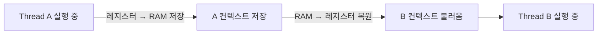

---
tags:
  - 개념
  - 컴퓨터구조
  - OS
  - 스레드
created: 2026-04-22
sources:
  - "session: 2026-04-22 CPU 복습"
related:
  - "[[CPU]]"
  - "[[RAM]]"
  - "[[레지스터]]"
---

## 왜 이 이름인가

- **컨텍스트(context)** — 실행 중인 스레드의 **"현재 상태 스냅샷"**. 레지스터에 들어 있는 값들과 프로그램 카운터(지금 어느 명령어를 실행 중인지)가 핵심.
- **스위칭(switching)** — 그 컨텍스트를 다른 스레드의 컨텍스트로 **교체**하는 동작.

"컨텍스트 = 실행을 이어가려면 반드시 필요한 최소 정보"라고 기억하면 된다. 이 정보만 복원하면 스레드는 "어디까지 했었는지"를 잊지 않고 재개할 수 있다.

## 기존 문제

코어 수보다 스레드 수가 훨씬 많은 상황이 일반적이다 (예: 8코어 CPU에 100개 스레드).

- 한 스레드를 처음부터 끝까지 돌리고 다음 스레드로 넘기는 방식(배치)이라면, 100번째 스레드는 앞선 99개가 다 끝날 때까지 기다려야 함
- I/O 바운드 스레드가 외부 응답을 기다리는 동안 CPU는 완전히 놀게 됨
- "동시에 돌아가는 것처럼" 보이려면 스레드를 **짧은 시간 간격으로 번갈아가며** 실행해야 함

## 어떻게 해결하는가

OS 스케줄러가 정해진 시간 단위(time slice)마다 실행 중인 스레드를 교체한다.

**교체 절차**:

1. **저장** — 현재 실행 중이던 스레드 A의 컨텍스트(레지스터 값들 + PC)를 **RAM**의 특정 영역에 복사
2. **복원** — 다음에 실행할 스레드 B의 저장돼 있던 컨텍스트를 **레지스터로 다시 불러옴**
3. **재개** — CPU는 B의 PC가 가리키는 명령어부터 계속 실행

> **"컨텍스트" = 레지스터 값들의 스냅샷** 이라는 직관이 핵심이다.

## 비용

스위칭 자체가 공짜가 아니다.

- 레지스터 값을 RAM으로 옮기고 다시 불러오는 **메모리 접근 비용**
- 캐시가 새 스레드에 맞춰 다시 채워지는 **캐시 미스 비용**
- 스케줄러 실행 자체가 **CPU 시간**을 먹음

그래서 스레드를 무작정 많이 만들면 오히려 느려질 수 있다. 언제 스레드를 늘리고 언제 제한할지는 **작업의 성격(CPU 바운드 vs I/O 바운드)** 에 달려 있다.

## 백엔드 개발에서의 활용

- **스레드 풀 사이징** — CPU 바운드 작업은 스레드 ≈ 코어 수 (그 이상은 스위칭 오버헤드만 발생). I/O 바운드 작업은 스레드 >> 코어 수 (대기 중인 스레드 대신 다른 스레드가 코어 사용). → [[CPU]] 백엔드 섹션 참조
- **비동기/논블로킹 모델**(WebFlux, Netty 등)이 등장한 배경 — 스레드를 늘리는 대신 **한 스레드가 여러 요청을 이벤트 루프로 처리**해 스위칭 비용 자체를 회피
- **성능 모니터링** — `vmstat`의 `cs`(context switch) 수치가 비정상적으로 높으면 스레드 과다 생성·락 경합 등을 의심
